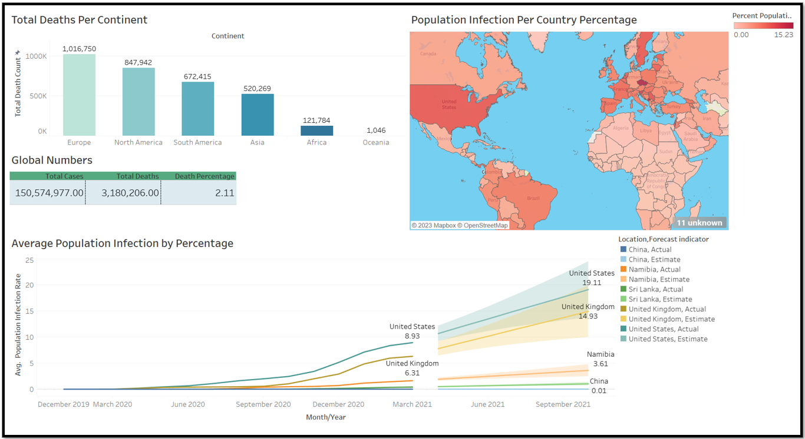
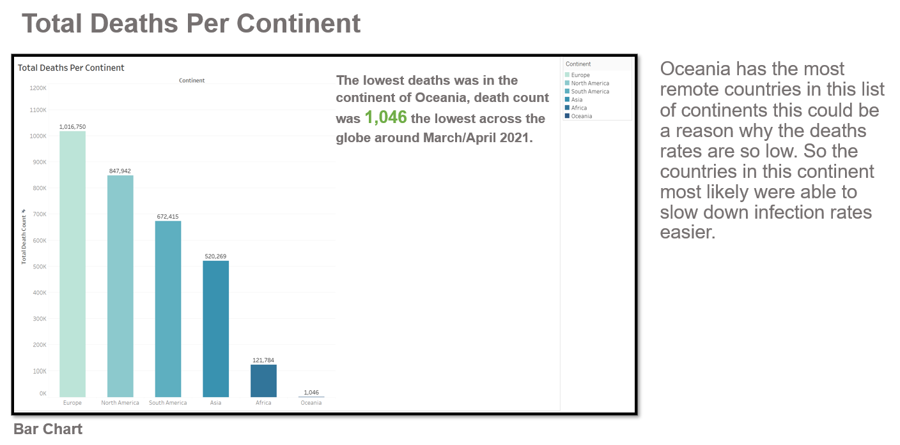
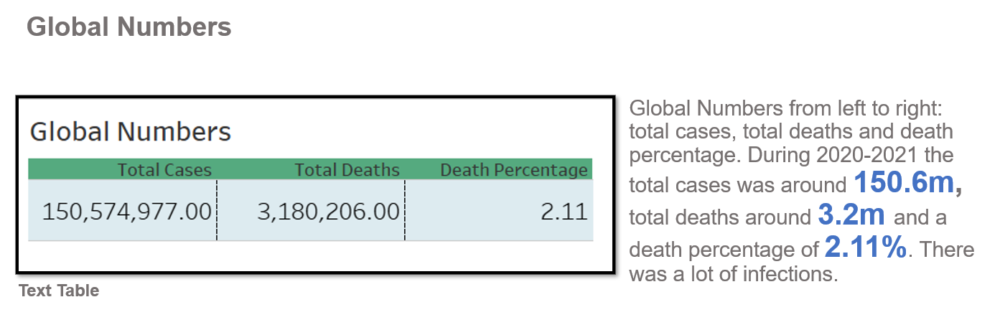
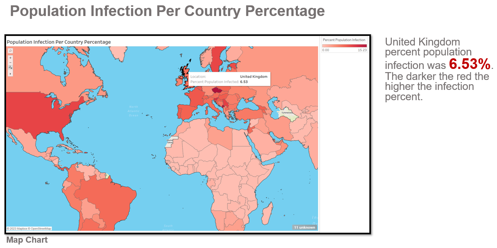
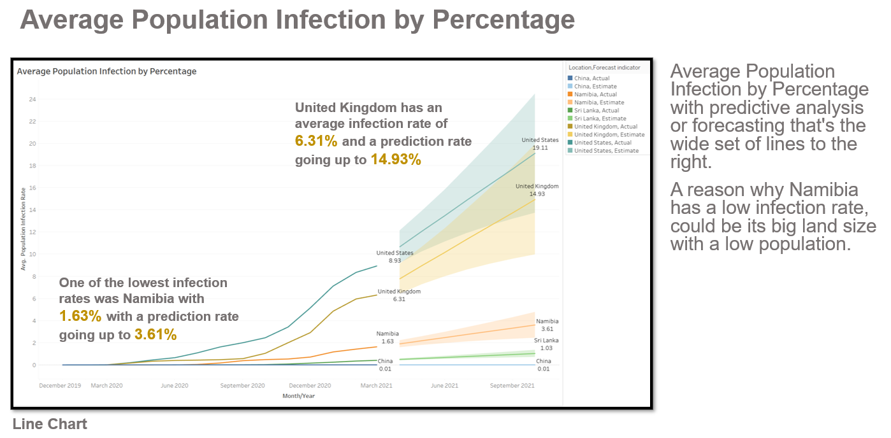

# WorldCovidData
## Dashboard displaying world Covid-19 data between 2020-2021. Using SQL queries/tables, next turning them into visualizations then into a dashboard using Tableau.
### Images and Gifs below click to expand.
 

In this report I will analyse worldwide covid-19 data.

### I will mention: 
<li>Total Deaths Per Continent: (Bar Chart)
<li>Global Numbers: (Text Table)
<li>Population Infection Per Country Percentage: (Map Chart)
<li>Average Population Infection by Percentage with predictive analysis or forecasting that's the wide set of lines to the right: (Line Chart)

### Software used:
<li>Microsoft SQL Server: For Data Exploration and to transfer the queries/tables to Excel.
<li>Microsoft Excel: Created four separate files/tables to import into Tableau.
<li>Tableau: Created four visualizations to produce an interactive dashboard to show the different findings.

  

 
  
 
  
 
  
 

## Summary

### In this report I analysed:

<li>Total Deaths Per Continent.
<li>Global Numbers.
<li>Population Infection Per Country Percentage.
<li>Average Population Infection by Percentage with predictive analysis or forecasting that's the wide set of lines to the right.
  

### Oceania with 1,046 was the lowest death count out of all the continents. Overall global Death percentage of 2.11% this means that there were more infections than deaths. United Kingdom percent population infection was 6.53% not the highest but not the lowest. Sri Lanka has one of the lowest infection rates with an average of 0.41%. Another one of the lowest average infection rates was Namibia with 1.63% with a prediction rate going up to 3.61%. Namibia has a small population for its land size this could be a factor.
 

### Average Population Infection by Percentage with forecasting: (Line Chart) and Population Infection Per Country Percentage: (Map Chart) in action.

[Live Link](https://public.tableau.com/views/CovidCasesDashboard_16687860876310/Dashboard1?:language=en-GB&:display_count=n&:origin=viz_share_link)
