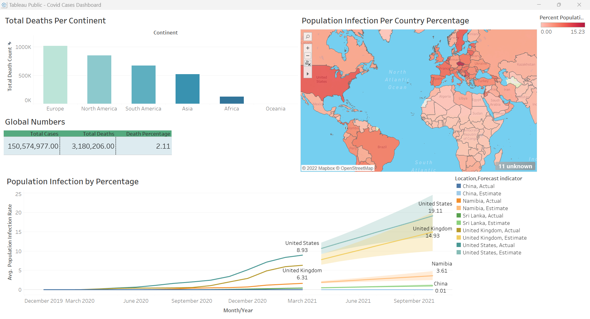
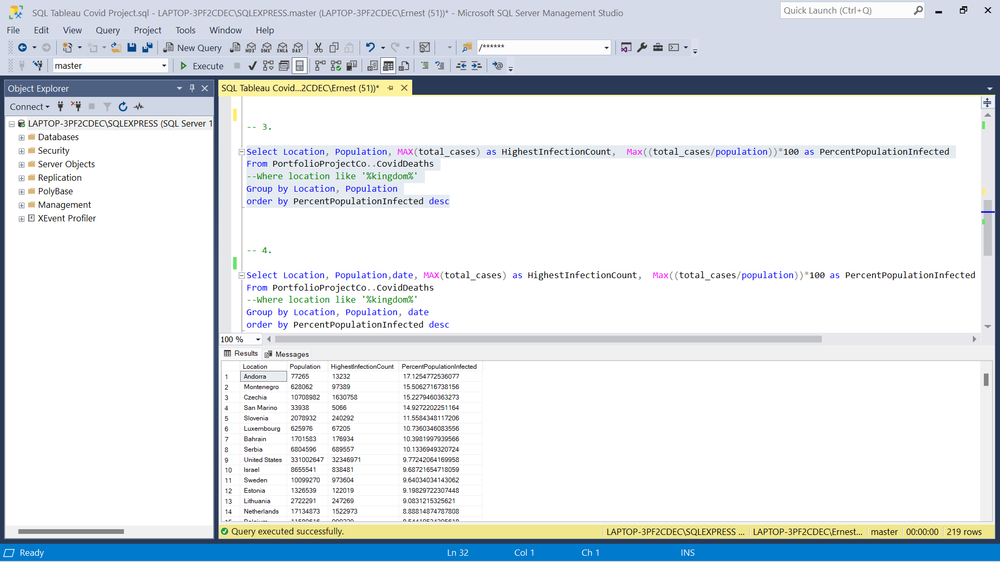

# WorldCovidData
## Dashboard displaying world Covid-19 data between 2020-2021. Using SQL queries/tables, next turning them into visualisations then into a dashboard using Tableau.
### Images and Gifs below click to expand.

Software used: 
<li>Microsoft SQL Server: For Data Exploration and to transfer the queries/tables to Excel. 
<li>Microsoft Excel: To create four separate files/tables to import into Tableau Public. 
<li>Tableau Public: To create four visualisations to produce an interactive dashboard to show the different findings. 

 

Charts used:
<li>Total Deaths Per Continent: (Bar Chart) 
<li>Global Numbers: (Text Table) 
<li>Population Infection Per Country Percentage: (Map Chart) 
<li>Average Population Infection by Percentage with predictive analysis or forecasting that's the wide set of lines to the right: (Line Chart) 

 
Image of MSSQL query 3: Population Infection Per Country Percentage: (Map Chart)

 
Total Deaths Per Continent: (Bar Chart), Global Numbers: (Text Table), Population Infection Per Country Percentage: (Map Chart) in action. 
Total deaths world wide around March/April 2021 was just over 3 million. Oceania death count was 1,046 the lowest across the globe around March/April 2021. 
Japan's infection rate was 0.47% one of lowest world wide. 

 
Average Population Infection by Percentage with forecasting: (Line Chart) and Population Infection Per Country Percentage: (Map Chart) in action.
United Kingdom has an average population infection rate 6.31% March 2021. 

[Live Link](https://public.tableau.com/views/CovidCasesDashboard_16687860876310/Dashboard1?:language=en-GB&:display_count=n&:origin=viz_share_link)
